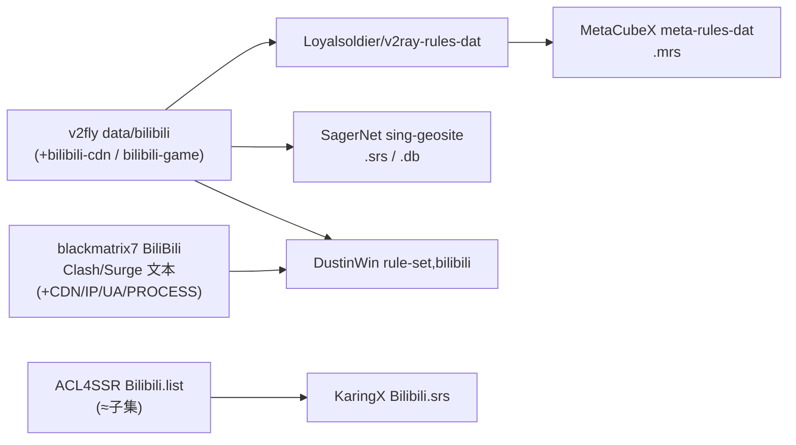
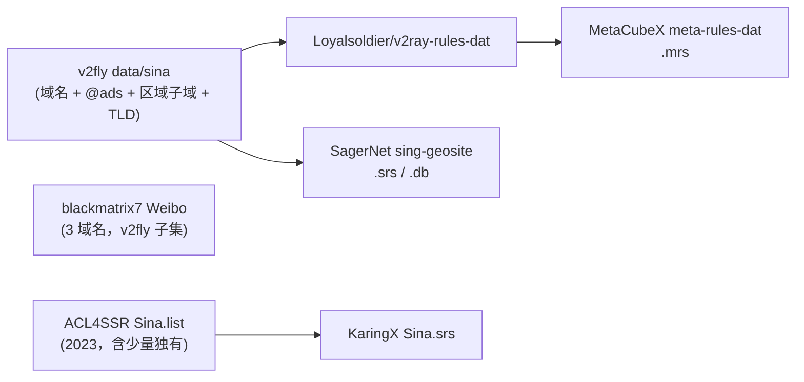
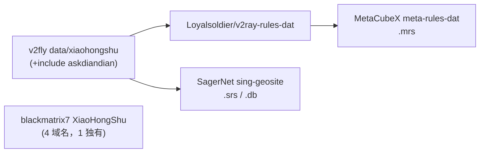
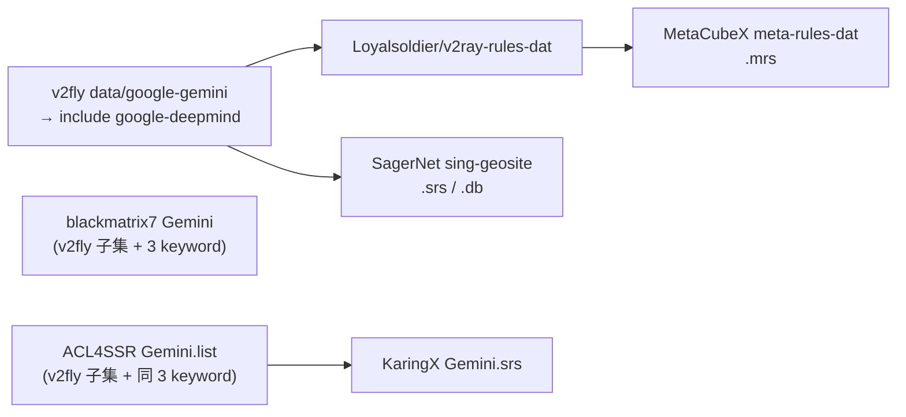
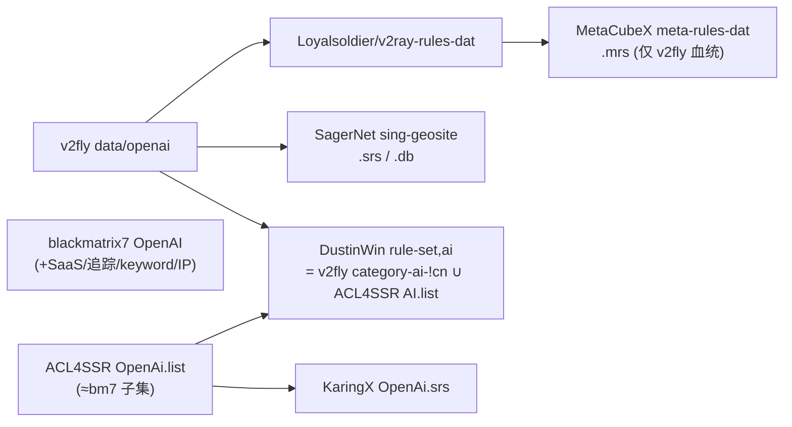
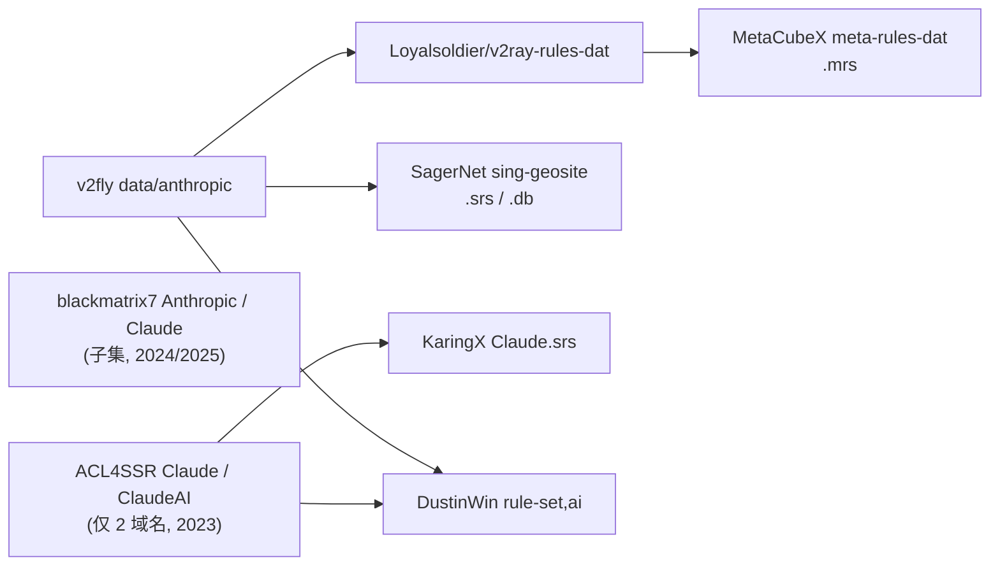

# 规则集分类覆盖与血缘分析

> 快照时间：2026-09-25。对象：`bilibili`、微博、小红书、`gemini`、`openai`、`anthropic`。
> 相关总览见 [`rule-set-reference.md`](./rule-set-reference.md)。

## 0. 方法论

- **不能只看规则条数**。各仓库的“条数”把易变 CDN 主机名、IP-CIDR、USER-AGENT、PROCESS-NAME 等都计入，直接比较会严重高估。
- 本文按**精确域名 token**（去重后的域名/后缀）计算覆盖：解析每个来源的实际规则文件，统计两两**交集**与各自**独有**条目。
- `v2fly` 的 `include:` 已递归展开；`@ads`/`@!cn` 属性保留在域名上；TLD、`DOMAIN-KEYWORD`、`regexp` 等非精确域名规则单独列为 **broad**，不计入精确域名集合。
- 派生仓库（`meta-rules-dat`、`sing-geosite`、`KaringX`、`DustinWin`）不重复解析，直接标明其**数据来源**。
- **术语**：本文的 “v2fly” 特指 **L1 的 `v2fly/domain-list-community`（域名）原始数据源**（即 [`rule-set-reference.md`](./rule-set-reference.md) 的 L1），overlap 数字均在此计算；`.srs` 的 L3 产物是 `SagerNet/sing-geosite`、`.mrs` 的 L3 产物是 `MetaCubeX/meta-rules-dat`，二者只是对同一 L1 数据的编译打包，不新增数据。下文 “v2fly 系” 即指这一 L1→L3 血统。

各来源的原始文件：

| 来源 | 文件 | 内容日期 |
| --- | --- | --- |
| v2fly | `data/{bilibili,sina,xiaohongshu,google-deepmind,openai,anthropic}` | 2026-06 ~ 2026-09 |
| blackmatrix7 | `rule/Clash/<Name>/<Name>.yaml` | 2025-06（Anthropic 2024-02） |
| ACL4SSR | `Clash/Ruleset/*.list` | 2023-11 ~ 2026-01 |

---

## 1. bilibili

**结论：** 三家核心域名高度重合；blackmatrix7 的“129 条”里约 50 条是 `ourdvsss.com`/`ksyungslb.com` 等**易变 CDN 主机名**，另加 IP/UA/PROCESS 规则。真正互为补集的是 v2fly 的几项国内业务域名与 blackmatrix7 的 CDN/IP/App 识别。ACL4SSR 基本冗余。

| 来源 | 精确域名 | 独有 | 额外（非域名） | 内容日期 |
| --- | --- | --- | --- | --- |
| v2fly `data/bilibili`(+`-cdn`,`-game`) | 53 | 5 | — | 2026-07-11 |
| blackmatrix7 `BiliBili` | 115 | 64 | 8 IP-CIDR / 4 USER-AGENT / 6 PROCESS-NAME | 2025-06 |
| ACL4SSR `Bilibili.list` | 20 | 1 | — | 2026-01-24 |

- 交集：`v2fly ∩ blackmatrix7 = 48`，`v2fly ∩ ACL4SSR = 16`，`blackmatrix7 ∩ ACL4SSR = 19`。
- v2fly 独有（业务向）：`bilicomic.com`、`huasheng.cn`、`maoer.com`、`missevan.com`、`updream.cn`。
- blackmatrix7 独有中约 50 条为 CDN 主机名（`*.ourdvsss.com`、`*.ksyungslb.com`、`*.dhost.00cdn.com`、`hdslb.com.w.kunlun*`、`upos-*`），其余为 `baka.im`、`biligame.cn`、`biliplus.com`、`corari.com`、`dyhgames.com`、`hdslb.net`、`mcbbs.net`、`sharejoytech.com`。其 **PROCESS-NAME/USER-AGENT** 是 Clash 独有的按 App 识别能力。
- ACL4SSR 独有仅 `apiintl.biliapi.net`。



---

## 2. 微博（v2fly / ACL4SSR 使用 `sina`）

**结论：** v2fly 一家独大，且包含 **@ads 追踪子域、海外区域子域、以及 `sina`/`weibo`/微博 punycode 的 TLD 级规则**；blackmatrix7 的 `Weibo` 只有 3 个域名，**完全被 v2fly 覆盖**；ACL4SSR `Sina.list` 停留在 2023 年，反而有个别奇怪的补充项。

| 来源 | 精确域名 | 独有 | broad | 内容日期 |
| --- | --- | --- | --- | --- |
| v2fly `data/sina` | 55 | 46 | TLD `sina` / `weibo` / `xn--9krt00a` | 2026-07-07 |
| blackmatrix7 `Weibo` | 3 | 0 | keyword `weibo` | 2025-06 |
| ACL4SSR `Sina.list` | 14 | 5 | — | 2023-03-23 |

- 交集：`v2fly ∩ blackmatrix7 = 3`（即 blackmatrix7 的全部），`v2fly ∩ ACL4SSR = 9`。
- v2fly 独有：大量 `@ads`（`log.sina.cn`、`click.uve.weibo.com` 等）+ 区域子域（`hk/my/sg/th/tw/us.weibo.com`）+ `t.cn`、`wbimg.*`、`wcdn.cn`、`weibopay.com`、`xhaiwai.com`。
- ACL4SSR 独有：`leju.com`、`miaopai.com`、`sinaapp.cn`、`weibocdn.cn`、`xiaoka.tv`。



---

## 3. 小红书

**结论：** 实际上**只有 v2fly 一条有意义的数据源**；blackmatrix7 的 4 条里有 3 条与 v2fly 重复，唯一独有的是风控服务 `fengkongcloud.com`（并非小红书专有）。ACL4SSR / KaringX / DustinWin 都没有该类目。

| 来源 | 精确域名 | 独有 | 内容日期 |
| --- | --- | --- | --- |
| v2fly `data/xiaohongshu`(+`include askdiandian`) | 12 | 9 | 2026-09-20 |
| blackmatrix7 `XiaoHongShu` | 4 | 1 | 2025-06 |

- 交集：`xhscdn.com`、`xhscdn.net`、`xiaohongshu.com`。
- v2fly 独有：`rednote.com`、`rednote.com.my`、`rednotecdn.com`、`redelight.cn`、`rnote.com`、`xhslink.com`、`xhsrcdn.com`、`askdiandian.com`、`diandianlife.top`（国际版/短链/点点 AI）。



---

## 4. Gemini

**结论：** v2fly `google-gemini` 实际只是 `include:google-deepmind`，而 `google-deepmind`（66 行）覆盖 AI Studio / NotebookLM / Jules / Labs / Opal / Antigravity / Code Assist 等，**几乎完全包含** blackmatrix7 与 ACL4SSR 的 Gemini 列表（后两者的精确域名各自有 0 个独有项），后两者唯一补充是 3 个相同的 `DOMAIN-KEYWORD`（`colab`、`developerprofiles`、`generativelanguage`）。

| 来源 | 精确域名 | 独有 | broad | 内容日期 |
| --- | --- | --- | --- | --- |
| v2fly `data/google-gemini`→`google-deepmind` | 43 | 34 | — | 2026-09-20 |
| blackmatrix7 `Gemini` | 10 | 0 | 3 keyword | 2025-06 |
| ACL4SSR `Gemini.list` | 10 | 0 | 同 3 keyword | 2024-08-27 |



---

## 5. OpenAI

**结论：** 唯一**真正互补**的类目。v2fly 偏官方基础设施（`chat.com`、`chatgpt.site`、`openaiassets`、Azure 资产、`qualtrics` 等），blackmatrix7 偏第三方 SaaS/追踪（`algolia.net`、`segment.io`、`launchdarkly.com`、`stripe.com`、`auth0.com` 等）并额外带 `keyword:openai` 与 IP；两者并集才完整。ACL4SSR 基本是 blackmatrix7 的子集。

| 来源 | 精确域名 | 独有 | broad / 额外 | 内容日期 |
| --- | --- | --- | --- | --- |
| v2fly `data/openai` | 22 | 8 | 1 regexp | 2026-07-13 |
| blackmatrix7 `OpenAI` | 31 | 9 | keyword `openai`、2 IP-CIDR、1 IP-ASN | 2025-06 |
| ACL4SSR `OpenAi.list` | 16 | 1 | keyword `openai` | 2025-04-30 |

- 交集：`v2fly ∩ blackmatrix7 = 13`，`v2fly ∩ ACL4SSR = 6`，`blackmatrix7 ∩ ACL4SSR = 14`。
- v2fly 独有：`chat.com`、`chatgpt.site`、`crixet.com`、`oaistatsig.com`、`openai.com.cdn.cloudflare.net`、`openaiassets.blob.core.windows.net`、`o33249.ingest.sentry.io`、`openai.qualtrics.com`。
- blackmatrix7 独有：`ai.com`、`algolia.net`、`api.statsig.com`、`launchdarkly.com`、`observeit.net`、`segment.io`、`static.cloudflareinsights.com`、`openai-api.arkoselabs.com`、`chat.openai.com.cdn.cloudflare.net`。



---

## 6. Anthropic / Claude

**结论：** v2fly `anthropic`（8 条）是最完整也最新的来源（含 `claude.com`、`claudeusercontent.com`、MCP 相关域名）；blackmatrix7 与 ACL4SSR 都几乎是其子集，且更新停在 2023–2024（ACL4SSR 合计仅 2 个域名）。

| 来源 | 精确域名 | 独有 | 内容日期 |
| --- | --- | --- | --- |
| v2fly `data/anthropic` | 8 | 5 | 2026-06-05 |
| blackmatrix7 `Anthropic` + `Claude` | 4 | 1 | 2024-02 / 2025-06 |
| ACL4SSR `Claude` + `ClaudeAI` | 2 | 0 | 2023-12 / 2023-11 |

- v2fly 独有：`clau.de`、`claude.com`、`claudemcpclient.com`、`claudemcpcontent.com`、`claudeusercontent.com`。
- blackmatrix7 独有：`cdn.usefathom.com`（统计服务）。
- ACL4SSR 独有：无。



---

## 7. 修正后的总体结论

1. **不要用条数衡量覆盖。** blackmatrix7 的大数字主要来自易变 CDN 主机名与 IP/UA/PROCESS 规则；按精确域名去重后，它在多数类目是 v2fly 的**子集 + 少量补充**。
2. **各分类的最优来源并不相同：**
   - 微博、小红书、Gemini、Anthropic：**v2fly 系**（v2fly 原始 → `sing-geosite`(.srs) / `meta-rules-dat`(.mrs)）明显最优。
   - OpenAI：需要 **v2fly ∪ blackmatrix7**；单源取 blackmatrix7（更广，含 SaaS/keyword/IP），但会漏掉 v2fly 的官方基础设施域名。
   - bilibili：**v2fly ∪ blackmatrix7**；blackmatrix7 的 CDN/IP/USER-AGENT/PROCESS-NAME 是域名单之外的能力，v2fly 补充国内业务域名。
3. **ACL4SSR 在这些类目里基本冗余**（尤其 Gemini/Anthropic/微博），且部分文件自 2023 起未更新；其价值主要在 `AI.list` 这类**合并式 AI 规则**。
4. **DustinWin 的相关类目只有 `bilibili` 与 `ai`**：
   - `bilibili = v2fly ∪ blackmatrix7`（较完整）；
   - `ai = v2fly category-ai-!cn ∪ ACL4SSR AI.list`，把 openai/gemini/anthropic 合并成一条，无法按 App 单独分流。
5. **按格式选：**
   - 纯文本/Clash：v2fly（原始）、blackmatrix7（含 App/IP）；
   - MRS：`meta-rules-dat`（= v2fly 血统；OpenAI 会缺 bm7 独有项）；
   - SRS：`sing-geosite`（= v2fly 血统）；
   - 合并 AI：`ACL4SSR AI.list` 或 `DustinWin rule-set,ai`。

---

## 8. 各分类推荐组合与 SRS 获取方案

按“并集完整度”给推荐。**单源就够的**直接取现成 `.srs`；**需要并集的**（bilibili、OpenAI）自行拉取 + 编译。下述流程已封装为本目录项目 `srs-compiler`：

```bash
npm run build                    # 构建 categories.json 中的全部分类 → out/*.srs
node build.mjs bilibili openai   # 只构建指定分类
```

- 分类与来源：[`categories.json`](../categories.json)
- blackmatrix7 → source JSON 转换器：[`lib/bm7-to-source.mjs`](../lib/bm7-to-source.mjs)
- 分发端点：`testingcf.jsdelivr.net`（见 `categories.json` 的 `base`）

### 8.0 工具链（已在 sing-box 1.14.1 实测）

```bash
# A. 单源：直接用现成 .srs（SagerNet/sing-geosite 的 rule-set 分支，每日构建，v2fly 血统）
#    https://testingcf.jsdelivr.net/gh/SagerNet/sing-geosite@rule-set/geosite-<cat>.srs

# B. 并集：解包现成 .srs + 转换 bm7，再合并编译
curl -sL -o geosite-<cat>.srs https://testingcf.jsdelivr.net/gh/SagerNet/sing-geosite@rule-set/geosite-<cat>.srs
sing-box rule-set decompile geosite-<cat>.srs -o v2fly-<cat>.json      # .srs → source JSON
node lib/bm7-to-source.mjs <Name>.yaml bm7-<Name>.json                 # blackmatrix7 → source JSON
sing-box rule-set merge merged.json -c v2fly-<cat>.json -c bm7-<Name>.json
sing-box rule-set compile merged.json -o <cat>.srs
```

> 备选：若一次要取**多个分类**，可只下聚合库 `geosite.db` 再 `sing-box geosite export <cat> -f geosite.db -o v2fly-<cat>.json`。两条路径（`decompile` 现成 `.srs` vs `export` 聚合 db）**实测并集完全一致**。

`lib/bm7-to-source.mjs` 字段映射：`DOMAIN→domain`、`DOMAIN-SUFFIX→domain_suffix`、`DOMAIN-KEYWORD→domain_keyword`、`IP-CIDR/IP-CIDR6→ip_cidr`、`PROCESS-NAME→process_name`；**`USER-AGENT` 在 sing-box rule-set 无对应字段，只能丢弃**。

### 8.1 推荐一览

| 分类 | 推荐组合（按完整度） | 现成 `.srs` | 需自建？ |
| --- | --- | --- | --- |
| bilibili | v2fly `bilibili` ⊕ blackmatrix7 `BiliBili`（+8 IP-CIDR、+6 process_name） | DustinWin `sing-box-ruleset/bilibili.srs`（= 域名并集，**不含 IP/process**） | 要 IP/App 时自建（Recipe A） |
| 微博 | v2fly `sina` | `geosite-sina.srs` | 否 |
| 小红书 | v2fly `xiaohongshu` | `geosite-xiaohongshu.srs` | 否 |
| Gemini | v2fly `google-gemini`（即 `google-deepmind`） | `geosite-google-gemini.srs` | 否（可选并入 bm7 的 3 个 keyword） |
| OpenAI | v2fly `openai` ⊕ blackmatrix7 `OpenAI`（+keyword、+2 IP-CIDR） | 无现成并集 | 是（Recipe B） |
| Anthropic | v2fly `anthropic` | `geosite-anthropic.srs` | 否 |

实测对照（bilibili）：`sing-geosite` = 53 域名；DustinWin = **120 域名、无 IP**；自建并集 = **120 域名 + 8 IP**。

### 8.2 Recipe A：bilibili（含 IP / App）

```bash
node build.mjs bilibili
# 等价于：解包 SagerNet geosite-bilibili.srs + 转换 blackmatrix7 BiliBili.yaml → merge → compile
# 产出 out/bilibili.srs（= v2fly ∪ bm7，含 8 IP-CIDR / 6 process_name）
```

### 8.3 Recipe B：OpenAI（v2fly ⊕ blackmatrix7）

```bash
node build.mjs openai
# 等价于：解包 SagerNet geosite-openai.srs + 转换 blackmatrix7 OpenAI.yaml → merge → compile
# 实测：并集共 42 个 token，与走 geosite.db export 的结果完全一致
```

> 若只想消费现成产物、不愿自建：OpenAI 可退而用 `geosite-openai.srs`（v2fly 官方基础设施，缺 bm7 的 SaaS/追踪域名）；等价地也可在 sing-box 配置里并列引用 `geosite-openai.srs` 与任一 bm7 转出的 srs（`rule_set: [a, b]` 即并集）。
